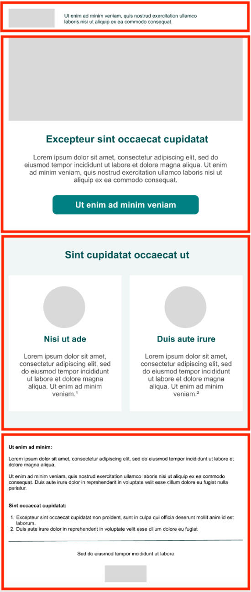
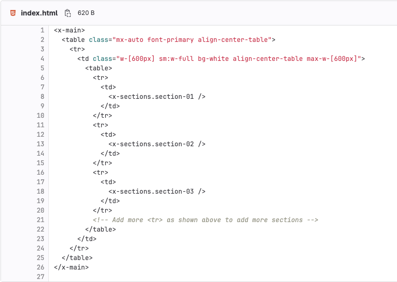
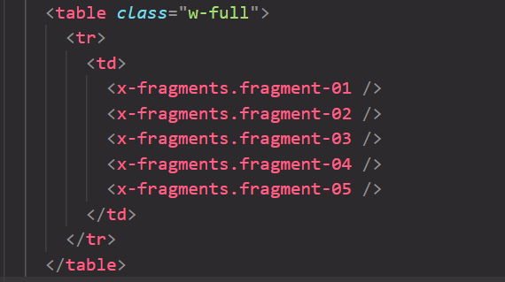
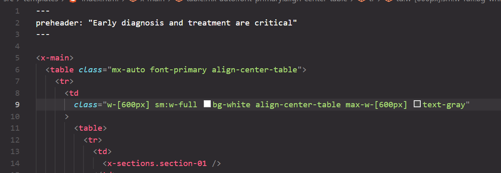
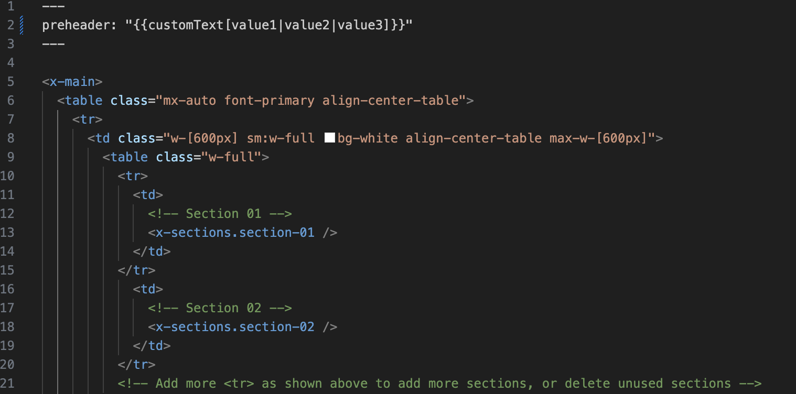

# 🧩 🧩 Maizzle framework

On this page you will find the following information:

* [Before you start](https://wiki.kindred.cz/doc/maizzle-framework-zdZrMPLKAF/edit#h-before-you-start)
* [Intro](https://wiki.kindred.cz/doc/maizzle-framework-zdZrMPLKAF/edit#h-intro)
* [Process](https://wiki.kindred.cz/doc/maizzle-framework-zdZrMPLKAF/edit#h-process)
* [Project structure](https://wiki.kindred.cz/doc/maizzle-framework-zdZrMPLKAF/edit#h-project-structure)
* [Pre-header](https://wiki.kindred.cz/doc/maizzle-framework-zdZrMPLKAF/edit#h-preheader)
* [Litmus testing](https://wiki.kindred.cz/doc/maizzle-framework-zdZrMPLKAF/edit#h-litmus-testing)
* [Uploading to Veeva and sending to QA](https://wiki.kindred.cz/doc/maizzle-framework-zdZrMPLKAF/edit#h-uploading-to-veeva-and-sending-to-qa)
* [Coding tips](https://wiki.kindred.cz/doc/maizzle-framework-zdZrMPLKAF/edit#h-coding-tips)
* [Styling guidelines](https://wiki.kindred.cz/doc/maizzle-framework-zdZrMPLKAF/edit#h-styling-guidelines)
* [Useful Scripts](https://wiki.kindred.cz/doc/maizzle-framework-zdZrMPLKAF/edit#h-useful-scripts)
* [Practice](https://wiki.kindred.cz/doc/maizzle-framework-zdZrMPLKAF/edit#h-practice)


A quick video intro to the Maizzle framework can be found [here](https://publicisgroupe-my.sharepoint.com/personal/ailwerne_publicisgroupe_net/_layouts/15/stream.aspx?id=%2Fpersonal%2Failwerne%5Fpublicisgroupe%5Fnet%2FDocuments%2FRecordings%2FMaizzle%20framework%2D20240119%5F114800%2DMeeting%20Recording%2Emp4&referrer=StreamWebApp%2EWeb&referrerScenario=AddressBarCopied%2Eview&ga=1).

Boilerplate is [here](https://gitlab.nurunprague.cz/pfizer/rte-maizzle/rte-maizzle-boilerplate)

## Before you start:

Please make sure you have:

* Installed NodeJS 18 or higher
* Installed prettier in VS code or whatever editor you prefer
* The boilerplate repository uses the Veeva Scripts package which is hosted on Gitlab. You need to set the authentication tokens for NPM like this <https://wiki.kindred.cz/doc/npmrc-J7IN3f54mZ>. This needs to happen only once.

# Intro:

Once you clone the files into your local computer, you will see that the folder structure for the Maizzle framework is quite more complex than what we're used to. Let's go through it.

The idea behind using this framework, is that it's a lot easier to share the workload for each template. Each section is coded into different html files, and this means that each team member can work on different sections of each email, without having merging issues on git, for example.

The framework uses Tailwind CSS. This means we have a lot (if not all) of the css attributes that we will ever need in one place. Here's Tailwind CSS cheat sheet for reference: <https://tailwindcomponents.com/cheatsheet/>

If you ever need to add extra styles, then you can do so in the files: Depending on what changes needed to be implemented. `reset.css`, `utilities.css`, or in `layouts.html` in the comment section if it concerns mso only.

Please make sure to go through everything in the README file on the folder you have just cloned. This file will be your go-to for the entire process.

# Process:

The old way of doing emails is creating one big html file with all the code inside it. From now on we will do things a little bit different. Each HTML/email will be divided into sections. You will decide what goes into each section. You can have as many sections as you need. See the screenshot below as an example, each section is defined in the red boxes for your reference:


 


You will then need to call each fragment into a section, and each section into your index.html (more on this below). The way you decide to divide each section, is completely up to you. You just have to make sure that's easy to understand and well organized (so if someone else needs to take over your project, they will understand what's going on). What is important is to have a separate section for the fragments, so it's more organized and easy to follow.

## Project structure

 


The most common files that you will work with are in places marked by (\*\*) and they are:

* section: **section-(two digit number).html** - each section of the email that you have to create. Remember that all sections have to follow the same naming pattern: `section-01.html`, `section-02.html`, and so on.


* fragments: **fragment-(two digit number).html** - fragments of email which you have to create. Remember that all fragments have to follow the same naming pattern: `fragment-01.html`, `fragment-02.html`, and so on. If you have fragments in your email, you will have to create a folder named `fragments` inside of the `components` folder

  \
* templates: **index.html** - here you can input your section into email template. Place for your sections are commented inside this file.


Each section and fragment will start with its own table. The only difference is that the fragments will have the fragments comments as per usual:

```markup
<!-- fragment 1 start -->
<table>
    <tr>
        <td>
            (Your content)
        </td>
    </tr>
</table>
<!-- fragment 1 end -->
```


```markup
<!-- fragment 2 start -->
<table>
    <tr>
        <td>
            (Your content)
        </td>
    </tr>
</table>
<!-- fragment 2 end -->
```

And so on.

Let's go through the process of building an email.

Once you define each section of the email, you will need to go into the main template: `PCF-XXX/src/templates/index.html`. This is what you will find there:

 


In here you will need to call each section, so that when you finish building them, you can see them in your build. The way to do this, is to add `<x-sections.section-01 />`, `<x-sections.section-02 />`, `<x-sections.section-03 />`, etc. You need to add as many sections as you have in your build. You will end up having something like the following:

 


The next step is to code each section. For that, you need to go to `PCF-XXX/src/components/sections/`. You will need to create as many html files as sections you have in the email. If you have any fragments in your email, then one of the sections will be used for those. Similar to what we did before on the index.html, we will now need to call each fragment to that section. For this you will need to add the following code: ` `, `<x-fragments.fragment-02 />`, `<x-fragments.fragment-03 />`, `<x-fragments.fragment-04 />`, `<x-fragments.fragment-05 />`, etc. The list of fragments needs to be surrounded by a table.  This is how it will end up looking:

 


Once you finish coding the sections, you will need to get started with the fragments. For this, you will need to create a "fragments" folder at the same level as the "sections" one: `PCF-XXX/src/components/`. In there, you will need to create HTML for each fragment you have in your email. You need to follow the correct naming convention: `fragment-01.html`, `fragment-02.html`, `fragment-03.html`, `fragment-04.html`, `fragment-05.html`, etc.

When all the coding has been done, you will need to run a couple of scripts to get your files ready to upload.

## Preheader

If you ever need to add a preheader to your build, you will need to add it to the index.html file (`PCF-XXX/src/templates/index.html`). You should add the following right at the start of the html:

```
---
preheader: "Early diagnosis and treatment are critical"
---
```

Here's how it will look:

 

### Multiple Preheaders

Also you can use multiple preheaders by using {{customText\[value1|value2|etc…\]}}

```
---
preheader: "{{customText[value1|value2|value3]}}"
---
```

Here's how it will look:

 

After running veeva:build script it will generate the needed code to make multiple preheaders work and make it choosable before sending.

# Litmus testing:

[Litmus testing guide](https://wiki.kindred.cz/doc/litmus-testing-guide-d0iZQogFED)

Once you're done, and the email looks similar on localhost as in design, you need to ensure that your email will render correctly on all required email clients. To do it correctly, you have to run the build command (`npm run build`). The reason is that it automatically replaces all your tailwind classes with inline css, which is necessary for testing. Once you run that script, this will generate a folder called dist/full_version, and inside that folder you will find the index.html and the images. In litmus you will need to create a test on the builder (make sure to add the images as well). More on how to test on Litmus [here](https://docs.publicis.tech/doc/using-litmus-MZyF8nIAWG).

# Uploading to Veeva and sending to QA:

Once you're happy with your litmus test, you will need to start the process of uploading to Veeva. For this you will need to run the following script:

```
npm run veeva:build
```

This will create the final files for you to upload to Veeva. If your email doesn't have fragments in it, then you will find your final files in the folder `dist/full_version/`. If your email has fragments, then it will also create a second folder where the fragmented version will be: `dist/fragmented_version`.

Upload to Veeva, and send to QA.


# Coding tips:

You only need to work with <table>, <tr> and <td>. The usual attributes we add to our tables for example (role="presentation" cellpadding="0" cellspacing="0") have to be left out now, as they're added automatically by the veeva script. We only need to create the main structure, and add the tailwind classes to make it look like we want. Remember that you have Tailwind's cheat sheet for the css: <https://tailwindcomponents.com/cheatsheet/> . Here's an example of the code for reference:

```markup
<table>
    <tr>
        <td>
            <x-image
                class="w-[600px]"
                imgUrl="images/pfizer_logo.png"
            />
        </td>
    </tr>
</table>
```


```markup
<table>
  <tr>
    <td class="px-[50px]">
      <table>
        <tr>
          <td
            class="text-[#000049] text-[16px] leading-[22px] pt-[26px] text-justify"
          >
          {{customText[Cher|Ch&egrave;re|Bonjour|]}}
            {{customText[Docteur|Madame|Professeur|Monsieur|]}}
            {{customText[##accLname##|##accFname##|]}},
          </td>
        </tr>
        <tr>
          <td
            class="text-[#000049] text-[16px] leading-[22px] pt-[26px] text-justify"
          >
          {{customText[Comme discuté, |Suite à notre dernier entretien, |]}}
            {{customText[j'ai|J'ai]}} le plaisir de vous informer que Pfizer a
            développé, en collaboration avec des experts, trois vidéos
            explicatives à l'attention de patientes atteintes d'un cancer du
            sein et de leurs proches.
          </td>
        </tr>
        <tr>
          <td
            class="text-[#000049] text-[16px] leading-[22px] pt-[26px] text-justify"
          >
            Ces vidéos complètent la série de 17 vidéos déjà existante et
            réfèrent d'ailleurs à certaines d'entre-elles.<br />
            Les sujets traités dans ces 3 vidéos sont la mammographie, les
            principaux tests moléculaires et les différents stades du cancer du
            sein.
          </td>
        </tr>
        <tr>
          <td class="pt-[50px]">
            <x-image
              class="w-[600px]"
              imgUrl="images/blue-line.png"
            />
          </td>
        </tr>
      </table>
    </td>
  </tr>
</table>
```


If you want to create a table that has only one column, see the example below:

```html
<table>
  <tr>
    <td>paragraph 1</td>
  </tr>
  <tr>
    <td>paragraph 2</td>
  </tr>
</table>
```


As you see, every type of content goes **always** inside the <td> element.

If you want to have a table with multiple columns, here is how you can do it:

```html
<table>
  <tr>
    <td>column 1</td>
    <td>column 2</td>
    <td>column 3</td>
  </tr>
</table>
```


Sometimes you have to implement a multicolumn table inside a table with only one column, and then you have to use nested tables:

```html
<table>
  <tr>
    <td>
      paragraph 1
    </td>
  </tr>
  <tr>
    <td>
      <table>
        <tr>
          <td>
            column 1
          </td>
          <td>
            column 2
          </td>
          <td>
            column 3
          </td>
        </tr>
      <table>
    </td>
   </tr>
</table>
```


Do not use colspan on tables, it does not work on some email clients - it can also crash your table layout.

Each time you need to add an image, you will need to use the <x-image/> tag to do so. You can add all the different attributes (width, imgUrl, href, etc) inside that tag:

```html
<x-image class="w-[450px]" imgUrl="pfizer_footer.png" href="http://www.google.com" />
```

# Styling guidelines:

* Use only tailwind classes - we do not use inline CSS or especially custom CSS classes to keep the styling consistent across the whole project. Tailwind css cheet sheet: <https://tailwindcomponents.com/cheatsheet/>
* The only exception to inline styling can be dealing with borders, they may not render in all email clients when using tailwind.
* Do not use any styling on <tr> element - styling classes work correctly often only on <td> and <table> elements.
* Use only paddings (instead of margin, and do not mix the two) - **padding works only on <td>!**
* Type the exact values you want to use for properties like padding or text size, for example: **px-\[10px\]** instead of **px-6**. Tailwind by default uses rem and em values, they do not work correctly on all email clients - that's why we always use pixels.
* Padding left and right or padding top and bottom: Instead of adding those separately, you can add padding x (horizontal padding) or padding y(vertical padding). If you use padding x: px-\[10px\] is the same as writing them separately like this: pl-\[10px\] pr-\[10px\]. The same thing applies to padding y: having py-\[15px\] is the same as having the individual values: tp-\[15px\] pb-\[15px\].
* It's possible that some values can repeat often in your email - certain color or font size. You can define these values in tailwind config file (tailwind.config.cjs) during project setup.

  ```javascript
  extend: {
        colors: {
          gray: "#6e6e6e",
          purple: "#dc1a79",
          lightGray: "#f1f1f1",
          blue: "#203e92",
        },
  }
  ```
* On some email clients, the spacing between paragraphs does not work correctly. To deal with this issue you can use example below as a separator:

```html
<p style="text-[12px]">&nbsp;</p>
```

* We defined a special tailwind class to deal with positioning table content:

```html
<table class="align-center-table"></table>
```

```html
<table class="align-right-table"></table>
```

```html
<table class="align-left-table"></table>
```

* **Image size** - when you have to put images inside your section always define the width of  by tailwind classes w-\[(size)px\]. For example, if your image takes the whole width of the email, you need to add class w-\[600px\].

```html
<x-image
  class="w-[600px]"
  imgUrl="hero.png"
/>
```

* If you need to add a link to an image, you do so by adding an attribute to the image itself. As you may know, we need to add a link to ALL images in Pfizer. This is because we either need a link behind it, or need an empty link tag behind it to prevent the download icon from appearing. If the client hasn't provided a link, then you DON'T need to add a href to the image, this will be done ***automatically*** when you run the Veeva script. If the client sends a specific link to it, then you need to add it like this:

```html
<x-image class="w-[450px]" imgUrl="pfizer_footer.png" href="http://www.google.com" />
```

* If you want your links have underline, use additionally class `class="underline"`

```markup
<a
  href="http://www.google.com"
  class="text-black underline"
  target="_blank"
  >click here</a>
```

* If you have a number or address that shows up as a link in Litmus (blue and underlined), and you need to avoid this, you have to add the following link surrounding such number:

  ```markup
  <a href="#" class="text-black pointer-events-none">0800/78 614</a>
  ```
* We should only use padding top to style your section wrapper. As using padding bottom will cause the problem when sections are merged.
* Provide text-\[sizepx\]on each tag that wrap text, as in outlook font size are not inherited.
* If you need to target something specifically for mobile, you can add a class that targets mobile only. The way to do it is by adding sm: there. For example if you need 2 sections to stack on mobile, you would add the following 2 sm: classes to each <td>:

  ```markup
  <td class="w-[245px] max-w-[245px] sm:w-full sm:inline-block">
  ```


* If you have a number or email address that doesn't have to look like a link, you would add an empty link tag around it with the following classes:

  ```markup
  <a href="#" class="text-black pointer-events-none decoration-none">042735062/E</a>
  ```


* If you have an email address that you don't want it to have an underline to it, you will need to add the following:

```markup
<a
  href="mailto:gdpritaly@pfizer.com?subject=unsubscribe"
  class="text-black decoration-none">gdpritaly@pfizer.com</a>
```

* Hide and show the method for mobile and desktop layouts: Maizzle and Tailwind CSS offer a simple approach to handling desktop and mobile layouts. By using the "hidden" CSS class with responsive breakpoint prefixes, you can easily hide elements on mobile or desktop devices. This technique allows seamless switching between layouts, optimizing the user experience across platforms.

```markup
<p class="sm:hidden block">Hidden on Mobile, Visible on Desktop</p>
<p class="hidden sm:block">Visible on Mobile, Hidden on Desktop</p>
```

* Using `w-full` in the images itself, make the email go wider than required on most outlooks. Please avoid using this class in the images. Adding the actual width of the image will work better. For example, `w-[600px]` instead of `w-full`.
* Superscript can be done this way, and you can play with the different attributes (font-size, vertical-align) to make it look as similar as possible to the visual:

  ```markup
  <span class="text-[9px] [line-height:0] [vertical-align:6px]">1</span>
  ```

# Useful scripts:

Clone this starter:

```bash
git clone (paste here ssh or https code)
```


Install dependencies: You will need to navigate into the correct folder (`cd ~/PCF-XXX/`) and run the following script:

```
npm install
```


Start local development (live preview of the email in a browser):

```
npm run dev
```


Command to test the email in Litmus:

```
npm run build
```


Creating the final files for Veeva: This script will generate additional files inside your main folder (dist/full_version and dist/fragmented_version). These files will have to be uploaded to Veeva - for exact instructions, click [here](https://docs.publicis.tech/doc/uploading-to-veeva-8fa5vTpgZA).

```
npm run veeva:build
```


# Practice:

Before doing real work on Maizzle, we want you to do a test drive.

 Please find the assets for this test [here](https://publicisgroupe-my.sharepoint.com/:f:/g/personal/ondsvec_publicisgroupe_net/EtRWpxSEsEZKrGy-AFUJs64B2IKn3r67R6oyHusFa_H44Q?e=cB69nd)


:::info
The last 3 sections are not marked as fragments in the assets, but please treat them as additional fragments for this test (the section with the reps details + 2 footers).

:::

Please see below the steps for it:


1. Go to Gitlab and fork the Maizzle boilerplate <https://gitlab.nurunprague.cz/pfizer/rte-maizzle/rte-maizzle-boilerplate> into the group `pfizer/rte-maizzle/shadowing` and name it with  `team-yourteamname-assetjiraid` so for example `team-rocket-PCF000` . In the fork, select only the Master branch to be added to your final repository.
2. Clone on your desktop and proceed with email dev with the process as described above (section Process)


\